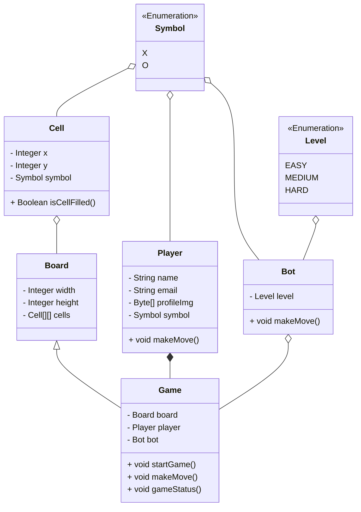
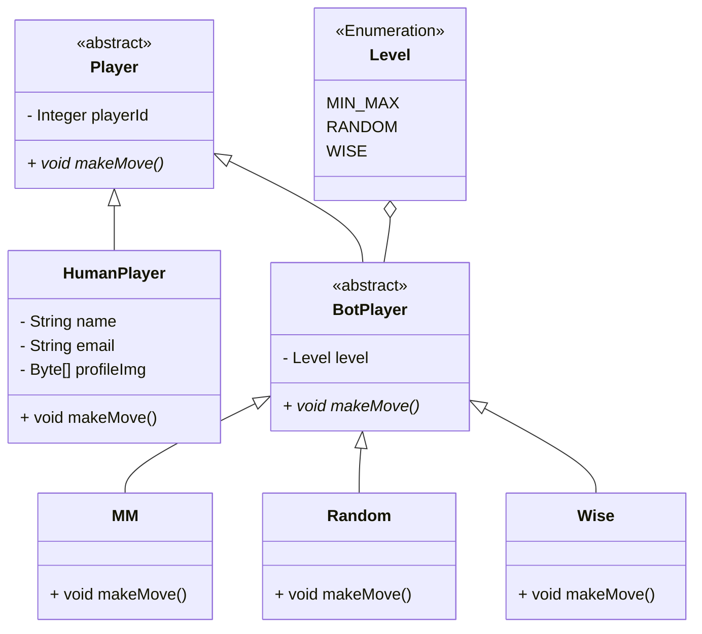
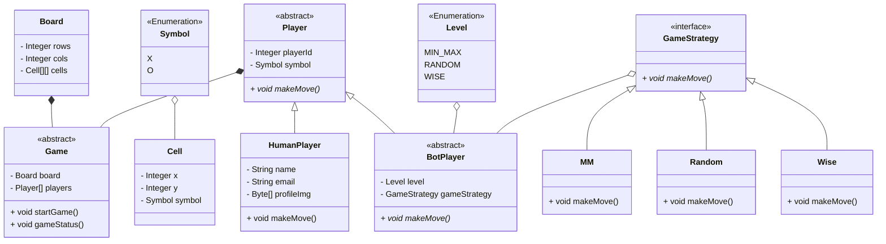

# TIC-TAC-TOE

- Board can be of any NxN size.
- There can be two players.
- Each player will be allotted a symbol.
- The symbol can be one of O and X.
- The players can be of type either human or bot.
- Each human player will have a name, email and profile image.
- Each bot player will have a difficulty level.
- Any random player can start the game.
- Then the players will take turns to play alternatively.
- The player with any consecutive N symbols in a row, column or diagonal wins. (check Winner)
- If the board is full and no player has won, the game is a draw.

## Steps

1. Board , Player, Bot , Game are entities.
2. Game contains Board, Player, Bot entities
3. Game contains move, startGame, gameStatus

### Problems

- Implementation of move method in Bot will be different based on level of game will lead to if-else will lead to SRP and OCP violation.

- We should be able to have match between two human players or one human and one bot. Here it is not happening

### Solutions

- To avoid Srp and Ocp violation we use subclasses.

- Here we should create parent Player class and this will be extended by Bot and Human.

- It is always better to have algorithm hierarchy seperately.

